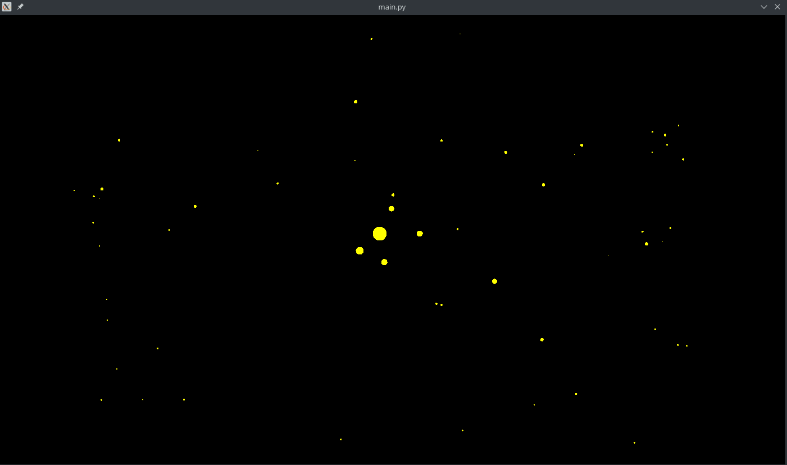

# Naive n-body simulation



This is a naive algorithm that simulates attraction between objects dependent on their mass, plastic collisions, etc.

This is bad code. Don't use this in real games. It's O(n^2) complexity, and doesn't leverage any linear algebra power. The only thing fast in it is pyglet, numba and a few simplifications in the computations.

## Why?

* To show that it's easy, fast, and fun. Easy relatively speaking. If you're not comfortable with looping through lists while manipulating them, this might seem complex, but don't let that deter you from learning.

* To show the power of Numba (go ahead, try it, comment it out)

* To show that pretty stuff doesn't have to be thousands of lines of code


## How to run?
Clone this repository
```
git clone https://github.com/apisarenco/naive-n-body-sim.git
```

Install the dependencies using [pip](https://pip.pypa.io/en/stable/installing/) and the `requirements.txt` file within the repository. You might want to create and activate a [virtualenv](https://www.pythoncentral.io/how-to-install-virtualenv-python/) first.

```
pip install -r requirements.txt
```

Run

```
python main.py
```
